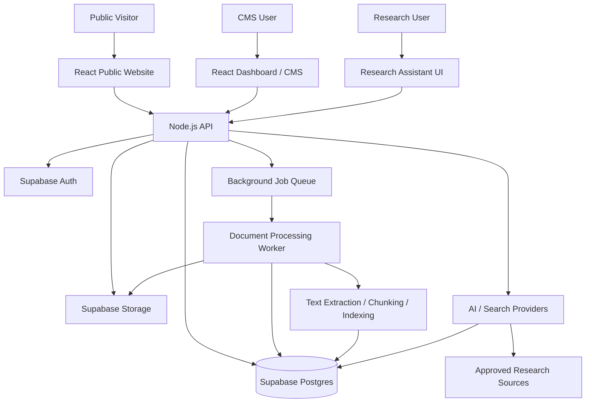

# Wasla Tech Platform — Architecture Overview

> **Document:** `docs/architecture.md`  
> **Version:** Draft v1  
> **Status:** Proposed architecture for team review  
> **Team Lead:** Malak  
> **Confirmed stack:** React.js + Node.js + Supabase

---

## 1. Purpose

This document describes the proposed technical architecture for Wasla Tech Platform based on the agreed module ownership and dependencies in `docs/roadmap.md`.

The platform includes:
1. Public Website
2. Portfolio
3. Dashboard / CMS
4. AI Research Assistant
5. Backend & Database
6. Document Processing

The goal is to define the main applications, responsibilities, data flows, security boundaries, and integration contracts before implementation begins.

## 2. Architecture Principles

- **One source of truth:** Supabase Postgres stores structured platform data.
- **API boundary:** React applications communicate with the Node.js backend for business operations.
- **Public vs. protected access:** Public visitors can read published content only; CMS actions require authentication and role authorization.
- **Secrets stay server-side:** Supabase service-role keys, AI provider keys, and other secrets must never be exposed in browser code.
- **Async for heavy work:** Document extraction and other long-running processing should run as background jobs.
- **Traceable AI answers:** Research responses should include citations to the retrieved sources and avoid presenting unsupported claims as sourced facts.
- **Contracts before parallel implementation:** Frontend and backend teams agree on API request/response shapes before building dependent features.

## 3. High-Level System Diagram



> The queue technology, worker runtime, and vector-search implementation are architectural decisions to confirm before implementation. The diagram shows responsibilities and relationships, not a final vendor selection.

## 4. Application and Repository Structure

### Proposed logical structure

```text
wasla-tech-platform/
├── apps/
│   ├── web/                 # Public website and portfolio
│   ├── dashboard/           # Protected CMS interface
│   ├── api/                 # Node.js API
│   └── document-worker/     # Background document processing
├── packages/
│   ├── shared/              # Shared types and constants
│   ├── validation/          # Shared request/data validation schemas
│   └── config/              # Shared linting/build configuration
├── docs/
│   ├── roadmap.md
│   ├── architecture.md
│   ├── git-workflow.md
│   └── acceptance-criteria.md
└── README.md
```

This is a proposed monorepo layout. Confirm whether the team will use a monorepo and whether the public website and dashboard should be separate React apps or one React app with separate route groups.

### Application responsibilities

| Component | Responsibility | Main dependencies |
|---|---|---|
| `apps/web` | Public homepage, articles, portfolio listing/details, contact UI | Public API, design system, published content |
| `apps/dashboard` | Login-protected CMS for content and portfolio management | API, Supabase Auth session, CMS permissions |
| `apps/api` | Business logic, validation, authorization, content APIs, AI orchestration, job creation | Supabase, AI/search providers, worker queue |
| `apps/document-worker` | Extract and normalize document content, update job status, prepare content for retrieval | Storage, database, extraction libraries, queue |
| `packages/shared` | Shared TypeScript types and common constants, if TypeScript is adopted | Used by web, dashboard, API |
| `packages/validation` | Reusable schemas for validating API payloads | Used by API and optionally frontend forms |

## 5. Technology Responsibilities

### React.js
- Renders the public website, portfolio, dashboard, and research assistant interface.
- Handles form state and client-side validation for usability.
- Calls backend APIs for data and actions.
- Does not contain privileged credentials or make privileged database operations directly.

### Node.js API
- Provides controlled endpoints for public content, CMS operations, AI requests, and document workflows.
- Validates incoming data.
- Authenticates users and checks permissions for protected operations.
- Coordinates Supabase, AI/search providers, and background jobs.
- Returns consistent errors and response formats.

### Supabase
- **Postgres:** structured content, user-role mappings, portfolio records, document metadata, processing status, and retrieval data.
- **Auth:** user sign-in/session management.
- **Storage:** media assets and uploaded documents.
- **Row Level Security (RLS):** database-level protection as an additional security layer. API authorization is still required; RLS is not a substitute for application checks.

## 6. Module Architecture

### 6.1 Public Website
**Owner:** Yasmin  
**Supporting:** Rem (UX/UI), Malak (integration/review)

- Displays homepage sections: Hero, About, Vision, Featured Products, Statistics, Team, News/Articles, Partners, Contact.
- Reads published content from public API endpoints.
- Uses media URLs or controlled asset access from Supabase Storage.
- Does not expose draft or unpublished CMS content.

**Dependency chain:** Information architecture + wireframes + content requirements → API contract → frontend implementation.

### 6.2 Portfolio
**Owner:** Yasmin  
**Supporting:** Rem (UX/UI), Alaa (sample data/content), Nour (API/database), Malak (integration)

- Provides portfolio listing and project detail pages.
- Project data includes title, slug, summary, problem, solution, technologies, category, status, cover/gallery, demo/repository links, team, featured flag, display order, and publication status.
- Public API returns published projects only.
- Dashboard manages project creation, editing, publishing, ordering, and media associations.

**Dependency chain:** Portfolio UX + sample project content + project schema + media/API contract → frontend and CMS integration.

### 6.3 Dashboard / CMS
**Backend owner:** Nour  
**UX/UI owner:** Rahma  
**Frontend support:** Yasmin and Mariam, split by page; Malak coordinates integration.

- Manages company information, homepage sections, news/articles, team, testimonials, partners, media, and portfolio projects.
- Uses roles: `owner`, `admin`, `content_editor`, `author`, `designer`, `viewer`.
- Every protected action must be authorized on the backend.
- UI may hide unavailable actions for usability, but backend permission checks remain mandatory.

**Dependency chain:** User flows + wireframes + role model + ERD + API contracts → CMS frontend/backend implementation.

### 6.4 AI Research Assistant
**AI owner:** Rodina  
**Frontend owner:** Mariam  
**Supporting:** Nadia (AI QA), Nour (API/data), Rahma (UX), Alaa (source registry/data)

- Searches approved research sources.
- Retrieves relevant source material before generating answers.
- Returns citations linked to source records.
- Separates source-derived content from generated explanation where applicable.
- Uses evaluation questions and test cases to assess retrieval and answer quality.

**Proposed source registry:** arXiv, Semantic Scholar, CORE, DOAJ, and PubMed Central open access. Confirm access methods, terms, rate limits, and availability during implementation.

**Dependency chain:** Source registry + retrieval design + API response contract + UX/citation design + evaluation dataset → integrated assistant.

### 6.5 Backend & Database
**Owner:** Nour  
**Supporting:** Malak (architecture and integration review)

- Owns Supabase setup, schema/ERD, API contracts, authentication integration, role authorization, storage access, validation, and database security policies.
- Defines stable request/response formats for frontend and AI modules.
- Documents schema changes and migration process as part of the Git workflow task.

### 6.6 Document Processing
**Technical integration/storage:** Nour  
**AI processing requirements:** Rodina  
**Supporting:** Mariam (UI), Nadia (QA), Alaa (test documents/data)

Proposed flow:
1. User uploads a supported document through the application.
2. API validates file type/size and authorization.
3. File is stored in Supabase Storage.
4. API creates a processing record and enqueues a job.
5. Worker extracts text and relevant metadata, then records status and errors.
6. Processed content is prepared for retrieval/indexing.
7. UI displays processing status and makes completed content available to the research workflow.

The exact extraction libraries, queue service, worker runtime, retry policy, and vector index are pending decisions.

## 7. Core Data Flows

### A. Public content request
1. Visitor opens a public page.
2. React app requests published content from the Node.js API.
3. API queries the relevant published records.
4. API returns only fields approved for public display.
5. React renders the page and associated media.

### B. CMS content publishing
1. CMS user signs in through Supabase Auth.
2. Dashboard sends an authenticated request to the API.
3. API verifies identity and role permissions.
4. API validates the payload and writes the content to Postgres.
5. Publishing state determines whether the content appears in public API responses.

### C. Research question
1. User submits a research query in the assistant UI.
2. API validates the request and applies applicable usage/access rules.
3. Search/retrieval locates relevant source records or document chunks.
4. AI orchestration prepares an answer grounded in retrieved material.
5. API returns the answer with citation metadata.
6. UI displays the answer and source links.

### D. Document upload and processing
1. UI requests an upload flow from the API.
2. API checks permissions and upload constraints.
3. Document is stored and a processing job is created.
4. Worker processes the document asynchronously.
5. Worker updates status and persists extracted content/metadata.
6. Retrieval workflow can use completed content.
7. UI shows `queued`, `processing`, `completed`, or `failed` status, with a useful error message when processing fails.

## 8. Security Boundaries

- Never commit `.env` files, tokens, service-role keys, or AI provider secrets.
- Keep privileged Supabase and AI credentials on the server/worker only.
- Require authentication for CMS operations.
- Enforce role authorization in the API for every create, update, delete, publish, and administrative action.
- Use Supabase RLS as defense in depth and test policies for each role.
- Public endpoints must filter out drafts, private records, and internal fields.
- Validate uploaded file types, sizes, and access permissions; do not trust file extensions alone.
- Restrict document and media access according to the intended visibility.
- Avoid logging passwords, access tokens, private document contents, or other sensitive data.
- Define rate limits and abuse controls for public endpoints and AI requests before production.

## 9. API Contract Expectations

Before parallel frontend/backend implementation, document the core endpoints and payloads. Initial contract groups:

| API group | Example operations | Access |
|---|---|---|
| Public content | Get homepage sections, articles, team, partners | Public; published records only |
| Portfolio | List published projects; get project by slug | Public; published records only |
| CMS content | Create/update/publish homepage content, articles, portfolio items | Authenticated + role permission |
| Media | Upload, list, associate, and remove media | Authenticated + role permission |
| Research | Search sources, submit question, retrieve cited answer | Public/authenticated policy to be decided |
| Documents | Upload document, check processing status, list permitted documents | Authenticated; scoped by permission |
| Admin/users | Manage users and roles | Owner/admin only, exact rules to be defined |

Each endpoint contract should specify:
- Method and path
- Authentication requirement
- Required role/permission
- Request schema
- Success response schema
- Error response format
- Pagination/filtering behavior where applicable

## 10. Decisions to Confirm Before Implementation

| Decision | Proposed direction / question | Responsible |
|---|---|---|
| Monorepo vs. multiple repositories | Proposed monorepo for shared contracts; confirm team preference | Malak |
| TypeScript | Recommended for shared types and API contracts; confirm adoption | Malak + Nour |
| Public site and dashboard apps | Separate React apps or one app with route groups? | Malak + Yasmin + Mariam |
| API framework | Select Node.js framework and standard middleware | Malak + Nour |
| Background queue | Select queue/job mechanism and retry behavior | Nour |
| Worker runtime | Node.js worker initially, unless extraction needs justify another runtime | Nour + Rodina |
| Vector search | Evaluate Supabase Postgres/pgvector versus an external vector store | Nour + Rodina |
| AI provider/model | Select provider, privacy constraints, cost limits, and fallback behavior | Rodina + Malak |
| Research source access | Confirm APIs, licensing/terms, rate limits, and citation metadata | Alaa + Rodina |
| File constraints | Define supported formats, maximum size, retention, and access policy | Nour + Rodina |
| Deployment environments | Define local, staging, and production setup | Malak + Nour |


## 11. Definition of Done — Task S0-02

- [ ] Diagram shows applications, backend, Supabase, AI/search, and document worker.
- [ ] Responsibilities of web, dashboard, API, worker, and Supabase are documented.
- [ ] Public content, CMS publishing, research, and document-processing flows are described.
- [ ] Module ownership aligns with `docs/roadmap.md`.
- [ ] Security boundaries and secret-handling rules are documented.
- [ ] Open architecture decisions have named owners.
- [ ] Team reviews the draft and records agreed decisions.
- [ ] Save this document as `docs/architecture.md`.
