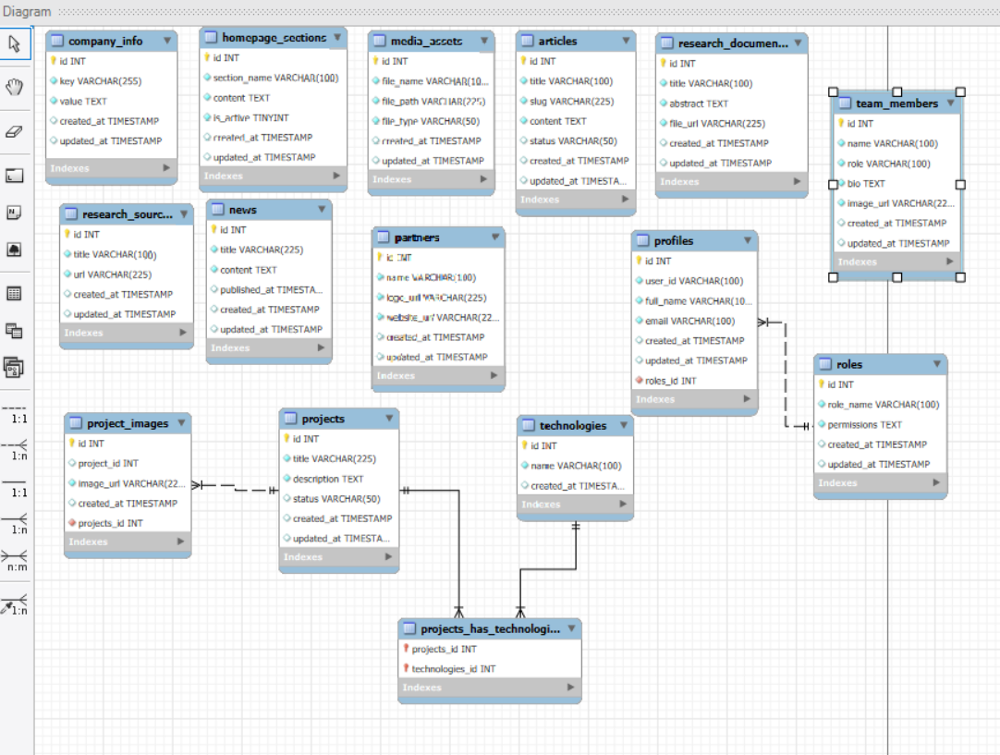

# Database Documentation (`docs/database.md`)

---

## Overview of Database Schema
The database has been designed to be flexible, secure, and capable of managing platform content, projects, news, and articles, as well as professionally managing administrator and user roles and permissions.

---

## Tables and Fields Details

### 1. `company_info` Table (Company Constants & Information)
Used to store general constants and platform information (such as phone number, email, and address) so they can be dynamically updated from the control panel.
* `id`: `INT` (Primary Key, Auto Increment, Not Null)
* `key`: `VARCHAR(225)` (Name of the key or variable, e.g., `phone_number`) - (Not Null)
* `value`: `TEXT` (Value of the key, using `TEXT` to support long text or terms of use) - (Not Null)
* `created_at`: `TIMESTAMP` (Creation timestamp)
* `updated_at`: `TIMESTAMP` (Last update timestamp)

### 2. `homepage_sections` Table (Homepage Sections)
Controls the visibility and content of various sections on the website's homepage.
* `id`: `INT` (PK, AI, NN)
* `section_name`: `VARCHAR(100)` (Name of the section, e.g., `about_us`) - (Not Null)
* `content`: `TEXT` (Full content of the section) - (Not Null)
* `is_active`: `TINYINT` (Section status: 1 for active, 0 for hidden)
* `created_at`: `TIMESTAMP`
* `updated_at`: `TIMESTAMP`

### 3. `roles` Table (Roles and Permissions)
Defines administrative levels and specific permissions for site managers (e.g., `Super Admin`, `Editor`).
* `id`: `INT` (PK, AI, NN)
* `role_name`: `VARCHAR(100)` (Name of the role) - (Not Null)
* `permissions`: `TEXT` (Detailed list of permissions)
* `created_at`: `TIMESTAMP`
* `updated_at`: `TIMESTAMP`

### 4. `profiles` Table (User Profiles)
Data of administrators and users responsible for managing the platform, linked to the external authentication system.
* `id`: `INT` (PK, AI, NN)
* `role_id`: `INT` (Foreign key linking the user to their role in the `roles` table)
* `user_id`: `VARCHAR(100)` (User identifier coming from `Supabase Auth` in UUID format) - (Not Null)
* `full_name`: `VARCHAR(150)` (Full name) - (Not Null)
* `email`: `VARCHAR(150)` (Email address) - (Not Null)
* `created_at`: `TIMESTAMP`
* `updated_at`: `TIMESTAMP`

### 5. `projects` Table (Projects)
Displays previous work and projects completed by the company.
* `id`: `INT` (PK, AI, NN)
* `title`: `VARCHAR(225)` (Project title) - (Not Null)
* `description`: `TEXT` (Detailed description of the project) - (Not Null)
* `status`: `VARCHAR(50)` (Project status, e.g., `Completed` or `Ongoing`)
* `created_at`: `TIMESTAMP`
* `updated_at`: `TIMESTAMP`

### 6. `project_images` Table (Project Images)
Allows adding multiple images for each project.
* `id`: `INT` (PK, AI, NN)
* `project_id`: `INT` (Foreign key linking the image to its original project in the `projects` table) - (Not Null)
* `image_url`: `VARCHAR(255)` (URL or path of the image) - (Not Null)
* `created_at`: `TIMESTAMP`

### 7. `technologies` Table (Technologies)
List of technologies and languages used in implementing projects.
* `id`: `INT` (PK, AI, NN)
* `name`: `VARCHAR(100)` (Name of the technology, e.g., `React`, `Node.js`) - (Not Null)
* `created_at`: `TIMESTAMP`

### 8. `projects_has_technologies` Table (Projects & Technologies Pivot Table)
A pivot table to resolve the Many-to-Many relationship between the `projects` and `technologies` tables.
* `projects_id`: `INT` (Foreign key pointing to the project) - (Not Null)
* `technologies_id`: `INT` (Foreign key pointing to the technology) - (Not Null)

### 9. `news` Table (News)
Company news, updates, and events.
* `id`: `INT` (PK, AI, NN)
* `title`: `VARCHAR(225)` (News title) - (Not Null)
* `content`: `TEXT` (News content) - (Not Null)
* `published_at`: `TIMESTAMP` (Publication timestamp)
* `created_at`: `TIMESTAMP`
* `updated_at`: `TIMESTAMP`

### 10. `articles` Table (Articles & Blog)
Technical articles and educational content for the platform.
* `id`: `INT` (PK, AI, NN)
* `title`: `VARCHAR(225)` (Article title) - (Not Null)
* `slug`: `VARCHAR(225)` (Short URL slug for the article in the browser) - (Not Null)
* `content`: `TEXT` (Full article content) - (Not Null)
* `status`: `VARCHAR(50)` (Article status: `Draft` or `Published`)
* `created_at`: `TIMESTAMP`
* `updated_at`: `TIMESTAMP`

### 11. `team_members` Table (Team Members)
Details of team members to display on the public frontend of the website.
* `id`: `INT` (PK, AI, NN)
* `name`: `VARCHAR(100)` (Member name) - (Not Null)
* `role`: `VARCHAR(100)` (Job title) - (Not Null)
* `bio`: `TEXT` (Short biography of the member)
* `image_url`: `VARCHAR(255)` (Personal profile picture)
* `created_at`: `TIMESTAMP`
* `updated_at`: `TIMESTAMP`

### 12. `partners` Table (Partners)
Success partners and supporting entities.
* `id`: `INT` (PK, AI, NN)
* `name`: `VARCHAR(100)` (Partner name) - (Not Null)
* `logo_url`: `VARCHAR(255)` (Partner logo)
* `website_url`: `VARCHAR(255)` (Partner website URL)
* `created_at`: `TIMESTAMP`
* `updated_at`: `TIMESTAMP`

### 13. `media_assets` Table (Media Assets)
Management of general files and attachments on the platform.
* `id`: `INT` (PK, AI, NN)
* `file_name`: `VARCHAR(225)` (File name) - (Not Null)
* `file_path`: `VARCHAR(225)` (Storage path) - (Not Null)
* `file_type`: `VARCHAR(50)` (File type)
* `created_at`: `TIMESTAMP`
* `updated_at`: `TIMESTAMP`

---

## Database Relationships

1. **One-to-Many Relationship (`roles` ➡️ `profiles`):**
   * A single role in the `roles` table can be assigned to multiple users/administrators in the `profiles` table.
   * Linked via the `role_id` field located in the `profiles` table.

2. **One-to-Many Relationship (`projects` ➡️ `project_images`):**
   * A single project in the `projects` table can contain multiple images in the `project_images` table.
   * Linked via the `project_id` field located in the `project_images` table.

3. **Many-to-Many Relationship (`projects` ↔️ `technologies`):**
   * A single project uses multiple technologies, and a single technology is used in multiple projects.
   * Linked via the `projects_has_technologies` pivot table.

---

## ERD Diagram
