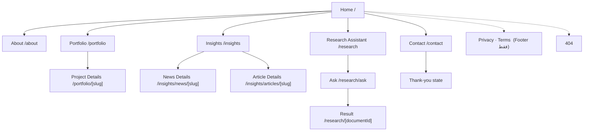

# Wasla Tech: Information Architecture & Sitemap

| | |
|---|---|
| **Task** | Task 2: Information Architecture للموقع العام |
| **Owner** | Reem Adel (UI/UX + Research) |
| **Status** | Draft v1.0 للمراجعة |
| **Based on** | Wasla Tech Vision Document v1.0 (يوليو 2026) |
| **Feeds into** | Task 3 (Wireframes) · Task 4 (Portfolio Content Requirements) |

---

## 1. نطاق الملف

الملف ده بيغطي **الموقع العام** بس: صفحاته، أقسامه، التنقل بينها، وإزاي كل صفحة بتقرا من قاعدة البيانات.

**خارج النطاق:** تفاصيل `/dashboard` و`/login` (دول Phase تانية من المشروع). هنكتفي بتوضيح حدودهم في القسم 9.

### المبادئ اللي الـ IA مبني عليها

| المبدأ | المصدر | التطبيق |
|---|---|---|
| الموقع قابل للإدارة بالكامل | Vision §01–02 | كل قسم في الصفحة ليه جدول بيغذيه (القسم 8) |
| الفصل بين الطبقات | Vision §04 | الواجهة قراءة وعرض بس، أي تعديل من الـ Dashboard |
| قابل للتوسع | Vision §01 | منتج جديد = سطر في `products` + مسار جديد، من غير تغيير الهيكل |
| الأعمال قبل الكلام | Task brief | أي زائر يوصل لمشروع في كليكين أو أقل |
| CTA واحد واضح | UX | زرار التواصل ظاهر في كل صفحة |

---

## 2. Sitemap



### نسخة الشجرة (للـ Repo)

```
/                                   Home
├── /about                          About (+ Team + Partners)
├── /portfolio                      Portfolio listing
│   └── /portfolio/[slug]           Project Details
├── /insights                       News + Articles listing (tabs)
│   ├── /insights/news/[slug]       News Details
│   └── /insights/articles/[slug]   Article Details
├── /research                       Research Assistant: Product 01
│   ├── /research/ask               Ask interface
│   └── /research/[documentId]      Translated result (Article / PDF-like template)
├── /contact                        Contact (+ thank-you state)
├── /privacy  /terms                Footer only
└── 404
```

> **ملحوظة:** `/products` (صفحة كل المنتجات) محجوزة في الـ IA بس **مخفية** لحد ما يبقى عندنا أكتر من منتج بحالة `live`. دلوقتي الـ Research Assistant هو المنتج الوحيد فبيتلينك مباشرة.

---

## 3. قائمة الصفحات

| # | الصفحة | المسار | الهدف | CTA الأساسي | الأولوية |
|---|---|---|---|---|---|
| 1 | Home | `/` | تعريف سريع بالشركة + توجيه للأعمال والتواصل | Start a Project | عالية |
| 2 | About | `/about` | الرؤية والرسالة والفريق والشركاء | Contact Us | متوسطة |
| 3 | Portfolio | `/portfolio` | عرض كل المشاريع مع فلتر | فتح مشروع | عالية |
| 4 | Project Details | `/portfolio/[slug]` | Case study لمشروع واحد | Start a Similar Project | عالية |
| 5 | Insights | `/insights` | أخبار + مقالات في مكان واحد | قراءة | متوسطة |
| 6 | News Details | `/insights/news/[slug]` | قراءة خبر | Related / Contact | متوسطة |
| 7 | Article Details | `/insights/articles/[slug]` | قراءة مقال تقني | Related / Contact | متوسطة |
| 8 | Research Assistant | `/research` | تعريف بالمنتج الأول وطريقة عمله | Try the Assistant | متوسطة |
| 9 | Ask | `/research/ask` | واجهة السؤال | Submit | متوسطة |
| 10 | Research Result | `/research/[documentId]` | عرض البحث المترجم جوه الموقع | Ask Another | متوسطة |
| 11 | Contact | `/contact` | استقبال الاستفسارات | Send Message | عالية |
| 12 | Privacy / Terms | `/privacy` `/terms` | قانوني | — | منخفضة |
| 13 | 404 | — | استرجاع المستخدم | Back to Home | منخفضة |

### قرارات في الهيكل

- **Team** قسم جوه `/about` مش صفحة مستقلة، لأن عدد الأعضاء قليل في المرحلة دي. لو كبر الفريق نفصله لـ `/team`.
- **News و Articles** صفحة listing واحدة (`/insights`) بتابز، لكن كل نوع ليه مسار تفاصيل مستقل. ده بيحافظ على الفرق بينهم في الـ schema (News بـ category، Articles بـ tags وauthor).
- **Services** قسم في الـ Homepage مش صفحة، لأن الـ Vision مفيهوش جدول للخدمات (شوفي النقطة 3 في القسم 10).

---

## 4. أقسام الـ Homepage

الترتيب ده هو **الترتيب الافتراضي**. في الـ Vision، الأقسام بتتحكم من جدول `homepage_sections` (`order_index` للترتيب و`is_active` للإظهار)، فالفريق يقدر يغيّر الترتيب من الـ Dashboard من غير كود.

| # | القسم | `section_key` | المحتوى | CTA | مصدر البيانات |
|---|---|---|---|---|---|
| 1 | **Hero** | `hero` | عنوان + سطر توضيحي + صورة أو فيديو | Start a Project · View Our Work | `homepage_sections` |
| 2 | **Partners Bar** | `partners` | شريط شعارات الشركاء | — | `partners` |
| 3 | **Services / Solutions** | `services` | 3–4 كروت للخدمات والحلول | Learn more | `homepage_sections` |
| 4 | **Featured Projects** | `featured_projects` | 3–4 مشاريع مختارة | View all projects → `/portfolio` | `projects` (جدول جديد) |
| 5 | **Research Assistant Teaser** | `product_research` | تعريف قصير بالمنتج الأول | Try it → `/research` | `products` |
| 6 | **Latest Insights** | `latest_insights` | آخر 2–3 أخبار أو مقالات | Read more → `/insights` | `news` + `articles` |
| 7 | **Testimonials** | `testimonials` | آراء العملاء (اللي `is_visible = true`) | — | `testimonials` |
| 8 | **Final CTA** | `final_cta` | دعوة قصيرة للتواصل | Contact Us | `homepage_sections` |
| 9 | **Footer** | — | القسم 6 | — | `company_info` |

### قواعد

- القسم اللي مالوش محتوى (مفيش آراء، مفيش أخبار) **يتخفى تلقائيًا** ومايظهرش فاضي.
- كل قسم هدف واحد وCTA واحد بحد أقصى.
- Featured Projects قبل الـ Research Teaser: أعمالنا أقوى دليل، والمنتج إضافة.

---

## 5. Navbar

| الموضع | العنصر | المسار |
|---|---|---|
| البداية | Logo | `/` |
| الروابط | About | `/about` |
| | Portfolio | `/portfolio` |
| | Insights | `/insights` |
| | Research Assistant | `/research` |
| النهاية | **Contact Us** (زرار مميز) | `/contact` |

**سلوك الـ Navbar:**
- Sticky عند السكرول، وActive state واضح للصفحة الحالية.
- جوه `/portfolio/[slug]` يفضل رابط Portfolio هو الـ Active، وكذلك Insights جوه صفحات المقالات والأخبار.
- موبايل: Hamburger بقائمة Full-screen، وزرار Contact Us ظاهر في آخرها.
- لو الموقع بلغتين: Language Switcher جنب الـ CTA (شوفي النقطة 1 في القسم 10).
- **مفيش زرار Login في الـ Navbar العام.** دخول الـ Dashboard بيتم بمسار مباشر `/login` للفريق بس، مش للزوار.

---

## 6. Footer

| العمود | المحتوى | المصدر |
|---|---|---|
| **عن الشركة** | Logo + نبذة سطرين + شعار "Connect the dots" | `company_info` |
| **Explore** | About · Portfolio · Insights · Research Assistant · Contact | ثابت |
| **Latest** | آخر خبرين أو مقالين | `news` + `articles` |
| **Contact** | Email · Phone · العنوان | `company_info.official_links` |
| **Social** | روابط التواصل الاجتماعي | `company_info.social_links` |
| **الشريط السفلي** | © Wasla Tech 2026 · Privacy · Terms | ثابت |

---

## 7. العلاقات بين الصفحات

### 7.1 Portfolio ↔ Project Details

```
Home (Featured Projects) ──┐
                           ├─►  /portfolio  ─►  /portfolio/[slug]
About / Insights (links) ──┘        ▲                  │
                                    └─ Back to Portfolio ┤
                                                         ├─ Related Projects ─► /portfolio/[slug]
                                                         └─ CTA ─► /contact
```

**Portfolio listing**
- شبكة كروت + فلتر بالنوع (All · AI · Web · Mobile ...).
- الكارت كله Clickable ويفتح `/portfolio/[slug]`.
- الكارت: صورة، عنوان، وصف قصير، Category، 2–3 Tech tags.

**Project Details** بالترتيب:
1. Breadcrumb: `Home > Portfolio > اسم المشروع`
2. Hero: Cover + Title + Category + Year
3. Overview
4. Challenge → Solution
5. Tech Stack كامل
6. Gallery
7. Results *(اختياري)*
8. Testimonial *(اختياري)*
9. Links: Live / Case Study *(اختياري)*
10. Related Projects (2–3 من نفس الـ Category)
11. CTA للتواصل + Back to Portfolio

**قواعد:**
- Featured Projects في الـ Homepage = نفس الكروت لكن بتتحدد بحقل `featured`.
- الأقسام الاختيارية الناقصة **تتخفى بالكامل**.
- الحقول التفصيلية في وثيقة Task 4.

### 7.2 Insights (الأخبار والمقالات)

| نقطة الوصول | الشكل |
|---|---|
| Navbar | رابط **Insights** |
| Homepage | قسم Latest Insights |
| Footer | عمود Latest |

- `/insights`: تابز **All · News · Articles** + فلتر Category/Tag.
- **News:** عنوان، صورة غلاف، تاريخ نشر، category.
- **Article:** عنوان، كاتب، تاريخ، categories وtags، وقت قراءة، Related Articles.
- بيظهر بس المحتوى بحالة `published`، والمسودات ما تظهرش للعامة.
- آخر كل تفاصيل: CTA للتواصل.

### 7.3 Research Assistant

```
/research  ─►  /research/ask  ─►  "جاري التجهيز..."  ─►  /research/[documentId]
```

- المعالجة بتتم في الخلفية (Vision §07)، فالمستخدم بيشوف حالة **"جاري التجهيز..."** وتتحدث تلقائيًا.
- النتيجة بتتعرض جوه الموقع بقالب Article أو PDF-like، ومفيش خروج لأي موقع خارجي.
- في القالب: رابط المصدر الأصلي + اسم الباحث/الناشر (مطلوب من ناحية حقوق النشر، Vision §06).
- لو نفس المصدر اتطلب قبل كده، بيتعرض فورًا من غير إعادة معالجة.

### 7.4 التواصل

| نقطة الوصول | الشكل |
|---|---|
| Navbar | زرار Contact Us ثابت |
| Homepage | Hero CTA + Final CTA |
| Portfolio details / About / Insights | CTA في آخر الصفحة |
| Footer | بيانات التواصل كاملة |

**صفحة `/contact`:**
- فورم: Name · Email · Phone *(اختياري)* · Service Interest · Message.
- بيانات مباشرة: Email · Phone · العنوان.
- Social links.
- **Thank-you state** بعد الإرسال برسالة تأكيد وروابط لـ Portfolio وInsights.

---

## 8. ربط الصفحات بالداتابيز

| الصفحة / القسم | الجدول | ملاحظات |
|---|---|---|
| Hero · Services · Final CTA | `homepage_sections` | الترتيب والإظهار من `order_index` / `is_active` |
| About (رؤية / رسالة / نبذة) | `company_info` | سطر واحد ثابت |
| About (الفريق) | `team_members` | `is_visible` + `order_index` |
| Partners Bar | `partners` | `order_index` |
| Testimonials | `testimonials` | `is_visible` |
| Insights: News | `news` | `status = published` |
| Insights: Articles | `articles` | `status = published` |
| Research | `research_*` + `products` | Whitelist من `research_sources` |
| Portfolio | **`projects` (غير موجود)** | ⚠️ شوفي القسم 10 |
| Contact | **جدول رسائل (غير موجود)** | ⚠️ شوفي القسم 10 |
| Logo / Social / Contact info | `company_info` | |
| الصور والملفات | `media_library` | |

---

## 9. حدود الـ IA: اللي خارج الموقع العام

| المسار | الحالة |
|---|---|
| `/login` | صفحة دخول للفريق، مش في الـ Navbar |
| `/dashboard/*` | محمي بالكامل (Next.js Middleware + Supabase RLS)، خارج نطاق التاسك ده |

أقسام الـ Dashboard حسب الـ Vision: بيانات الشركة، الصفحة الرئيسية، الأخبار، المقالات، الفريق، الشركاء، آراء العملاء، معرض الصور. وبالتبعية لازم تتضاف **المشاريع** (Portfolio) ورسائل التواصل.

---

## 10. نقاط محتاجة قرار من الفريق

| # | النقطة | ليه مهمة | اقتراحي |
|---|---|---|---|
| 1 | **اللغة:** الموقع عربي، إنجليزي، ولا الاتنين؟ | الـ schema الحالي فيه حقل نص واحد لكل محتوى، يعني لو الاتنين لازم الداتابيز تتعدل **قبل** البناء، وفي RTL | نحدد قبل ما نبدأ الـ UI |
| 2 | **جدول `projects`** | الـ Portfolio أساس Task 3 و4، ومفيش جدول ليه في الـ 14 جدول | يتضاف، وحقوله من وثيقة Task 4 |
| 3 | **جدول الخدمات** | الـ Vision مفيهوش Services، فمحتواها حاليًا نصوص في `homepage_sections` | نكتفي بـ `homepage_sections` دلوقتي، أو نضيف `services` لو هتتكرر |
| 4 | **جدول رسائل التواصل** (`contact_messages`) | الفورم محتاج يتخزن فين الرسايل وإزاي الفريق يشوفها | يتضاف + إشعار إيميل |
| 5 | **Research Assistant: عام ولا بحساب؟** | بيأثر على وجود Login للمستخدمين وحدود الاستخدام | قرار تقني من الفريق |
| 6 | **Team:** قسم ولا صفحة؟ | بيعتمد على عدد الأعضاء | قسم في About دلوقتي |
| 7 | **مشاريع تحت NDA** | الحقول الحساسة (اسم العميل، Live URL) لازم تبقى اختيارية | تتخفى لو فاضية |

---

## 11. رحلات المستخدم الأساسية

| السيناريو | المسار | عدد الكليكات لـ Contact |
|---|---|---|
| عميل محتمل جديد | Home → Portfolio → Project Details → Contact | 3 |
| حد عايز يشوف الأعمال بس | Home → View Our Work → Portfolio → Project Details → Related | — |
| جاي من جوجل على مقال | Article Details → Related Articles / Contact | 1–2 |
| طالب أو باحث | Home → Research Assistant → Ask → Result | — |
| جاهز يتواصل | أي صفحة → Contact Us (Navbar) → Form → Thank-you | 1 |

---

## 12. ملاحظات للموبايل

- ترتيب أقسام الـ Homepage زي ما هو، بعمود واحد.
- فلتر Portfolio يتحول لـ chips بتتسكرول أفقيًا.
- Partners Bar تبقى Marquee أو Scroll أفقي.
- Gallery في Project Details Slider.
- زرار الـ CTA كبير وفي مكان سهل للإبهام.
- صفحة Research Result: القالب يتحول لعمود واحد، والصور تتحمّل بشكل Lazy.

---

## 13. ربط الملف بباقي التاسكات

| التاسك | بياخد من الملف ده |
|---|---|
| **Task 3: Wireframes** | أقسام الـ Homepage (القسم 4)، علاقة Portfolio وProject Details (7.1) |
| **Task 4: Content Requirements** | حقل `featured` و`slug` و`category` وRelated Projects، وجدول `projects` (القسم 10) |
| **Task 1: Research** | المراجع بتتقارن بالهيكل ده، وأي تعديل بنحدّث بيه الملف |
